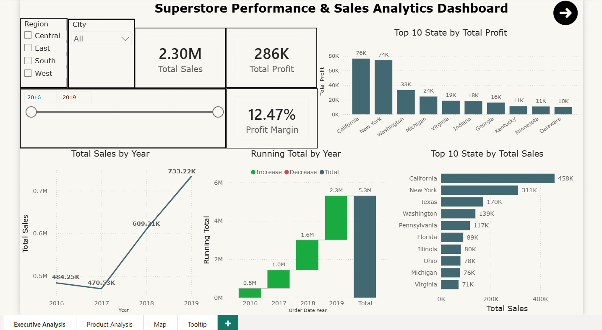
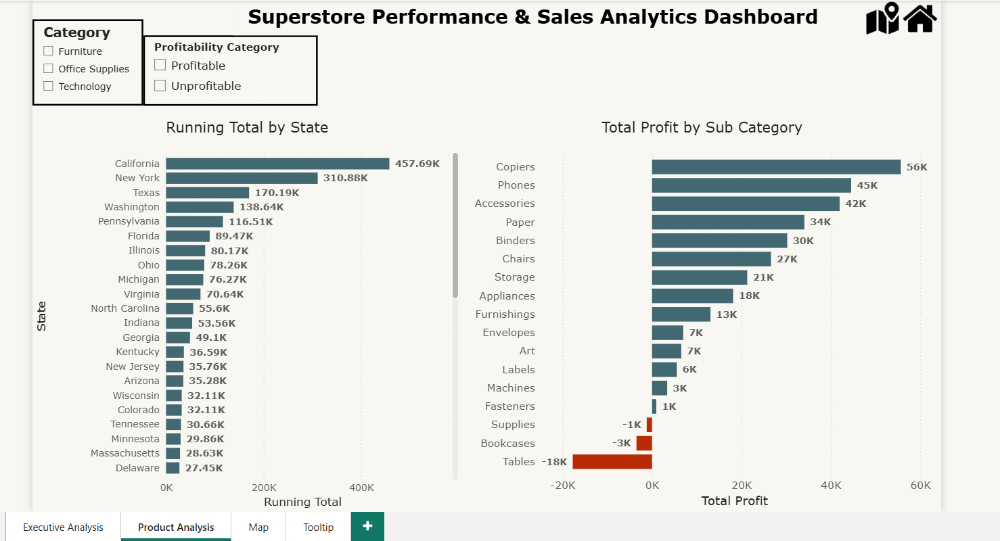
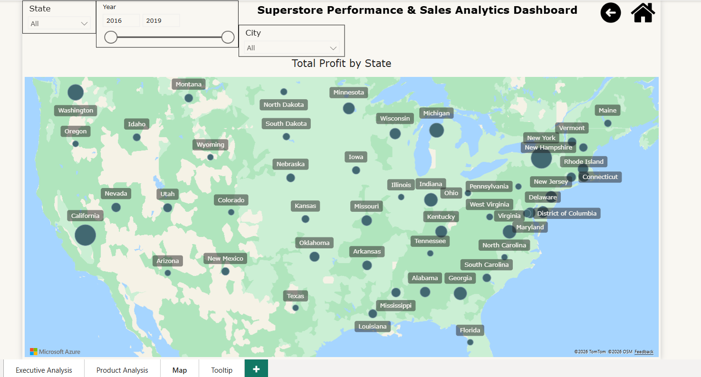

# Superstore Performance & Sales Analytics Dashboard

## Overview

An interactive Power BI dashboard developed to analyze Superstore sales performance, profitability, product categories, customer segments, regional performance, and geographical distribution.

## Project Objective

The objective of this project is to analyze Superstore sales and profitability data and create an interactive dashboard that helps users understand business performance and identify profitable and underperforming areas.

## Project Description

This dashboard provides a comprehensive overview of sales and profit performance across different products, categories, customer segments, states, cities, and regions.

The report includes interactive filters and visualizations that allow users to explore business performance by:

- Year
- State
- City
- Region
- Product category
- Customer segment

## Tools Used

- Power BI
- Power Query
- DAX
- Excel/CSV
- Data Modeling
- Data Cleaning
- Data Visualization
- Interactive Slicers

## Dashboard Features

- Total sales and total profit KPIs
- Profit margin analysis
- Sales and profit trends over time
- Sales analysis by product category
- Profit analysis by region
- Customer segment analysis
- Product performance analysis
- State and city performance analysis
- Geographical sales and profit visualization
- Interactive filters by state, city, and year

## Key Metrics

- Total Sales: $2.3M
- Total Profit: $286K
- Overall Profit Margin: 12.47%

## Key Insights

- Technology was the highest-performing product category.
- The dashboard compares sales and profitability across different regions.
- Customer segments were analyzed to identify their contribution to sales and profit.
- Geographical analysis highlights performance differences between states and regions.
- The dashboard helps identify profitable and underperforming products and areas.
- Interactive filters provide detailed insights by state, city, and year.

## Dashboard Preview

### Page 1: Overview



### Page 2: Sales Analysis



### Page 3: Regional Analysis



## Files Included

- `Superstore_Performance_Sales_Dashboard.pbix` - Power BI dashboard file
- `page-1-overview.png` - Dashboard overview preview
- `page-2-sales-analysis.png` - Sales analysis preview
- `page-3-regional-analysis.png` - Regional analysis preview
- `README.md` - Project documentation

## How to Use

1. Download the `Superstore_Performance_Sales_Dashboard.pbix` file.
2. Open the file using Microsoft Power BI Desktop.
3. Use the interactive slicers and filters to explore the dashboard.
4. Analyze sales, profit, products, categories, customers, regions, states, and cities.

## Project Structure

```text
superstore-performance-sales-dashboard/
├── README.md
├── Superstore\_Performance\_Sales\_Dashboard.pbix
├── page-1-overview.png
├── page-2-sales-analysis.png
└── page-3-regional-analysis.png
